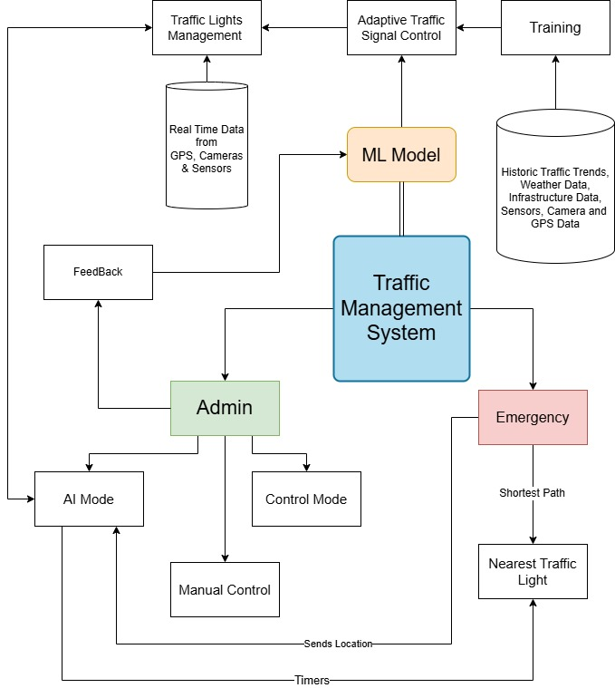

<p align="center">
 
</p>

<h1 align="center">Adaptive Traffic Signal Timer</h1>

<div align="center">

[](https://www.python.org/downloads/release/python-370/)
[](https://www.apache.org/licenses/LICENSE-2.0)

<h4>An AI-driven traffic management system using YOLOv8 for vehicle detection, reinforcement learning for adaptive signal control, and GPS for emergency vehicle prioritization to reduce congestion and emissions.<br>Note: This project is still in progress.</h4>
<h4>This Adaptive Traffic Signal Timer uses live images from the cameras at traffic junctions for traffic density calculation using YOLO object detection and sets the signal timers accordingly, thus reducing the traffic congestion on roads, providing faster transit to people, and reducing fuel consumption.</h4>

</div>

-----------------------------------------
### Inspiration

* Traffic congestion is becoming one of the critical issues with the increasing population and automobiles in cities. Traffic jams not only cause extra delay and stress for the drivers but also increase fuel consumption and air pollution.

* According to the [TomTom Traffic Index](https://www.tomtom.com/en_gb/traffic-index/ranking/), 3 of the top 10 countries facing the most traffic congestion are in India viz. Mumbai, Bengaluru, and New Delhi. People are compelled to spend hours stuck in traffic jams, wasting away their precious time commuting. Current traffic light controllers use a fixed timer and do not adapt according to the real-time traffic on the road.

* In an attempt to reduce traffic congestion, we developed an improved traffic management system in the form of a Computer Vision-based traffic light controller that can autonomously adapt to the traffic situation at the traffic signal. The proposed system sets the green signal time adaptively according to the traffic density at the signal and ensures that the direction with more traffic is allotted a green signal for a longer duration of time as compared to the direction with lesser traffic.

------------------------------------------
### Implementation Details

This project can be broken down into 3 modules:

1. `Vehicle Detection Module` - Responsible for detecting the number of vehicles in the image received as input from the camera. It provides the number of vehicles of each class such as car, bike, bus, truck, and rickshaw using YOLOv8.

2. `Signal Switching Algorithm` - Updates the red, green, and yellow times of all signals. Timers are set based on the count of vehicle classes received from the detection module, number of lanes, average speed of each class, and congestion level.

3. `Simulation Module` - A simulation developed from scratch using [Pygame](https://www.pygame.org/news) to simulate traffic signals and vehicles moving across a 4-way traffic intersection with dynamic signal timings.

Read more about object detection, reinforcement learning, and signal logic 
------------------------------------------
### Demo

* `Vehicle Detection`

<p align="center">
 
</p>

* `Signal Switching Algorithm and Simulation`

<p align="center">
    
</p>
* `Flowchart`

<p align="center">
    
</p>
* `Flutter Based App- GatiMitra`

<p align="center">
    
</p>
------------------------------------------
### Prerequisites

1. [Python 3.7](https://www.python.org/downloads/release/python-370/)
2. [Microsoft Visual C++ Build Tools](http://go.microsoft.com/fwlink/?LinkId=691126&fixForIE=.exe.) (for Windows)

------------------------------------------
### Installation

```sh
# Step I: Clone the Repository
git clone https://github.com/shivamsingh190103/Smart_AI_Traffic_Management_System.git

# Step II: Download the YOLO weights file and place it in:
# Adaptive-Traffic-Signal-Timer/Code/YOLO/darkflow/bin

# Step III: Install the required packages
cd Adaptive-Traffic-Signal-Timer/Code/YOLO/darkflow
pip install -r requirements.txt
python setup.py build_ext --inplace

# Step IV: Run the code
# For Vehicle Detection
python vehicle_detection.py

# For Traffic Simulation
python simulation.py

------------------------------------------
### Dissemination

I contributed to the research paper titled “Smart City Traffic Optimization: Reducing Congestion and Emissions with AI and Real-Time Vehicle Detection,” which was submitted to EGETC-2025. The updated version of the paper has been successfully acknowledged by the conference organizers.

I also participated in the Smart India Hackathon 2024 and cleared intra college hackthon, where this project was showcased as a practical AI-based solution to real-world traffic challenges.
------------------------------------------
### Contributors

Shivam Singh - [shivamsingh190103](https://github.com/shivamsingh190103)

Shivansh Tiwari 

------------------------------------------

### License
This project is licensed under the Apache License 2.0 - see the [LICENSE](./LICENSE) file for details.
  

